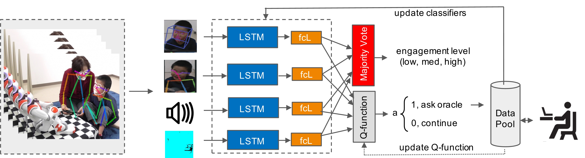
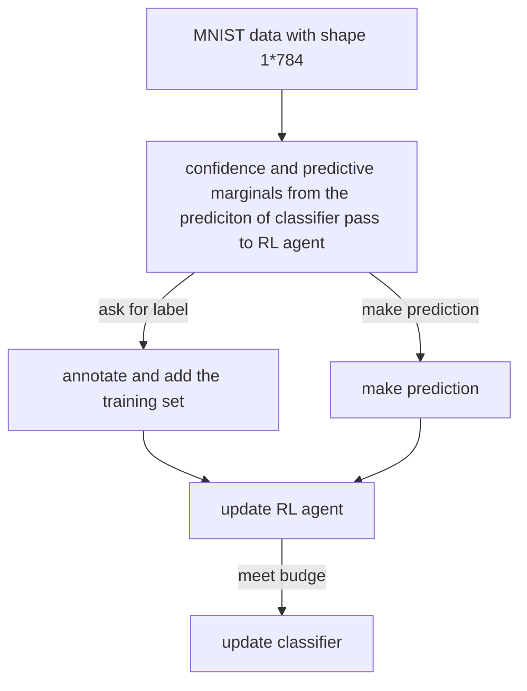

# Multi-modal Active Learning from Human Data: A deep Reinforcement Approach

Using DQN to train a RL agent (selector) to actively select samples. Samples selected then used to train classifiers (base learner).

This repository contains the official implementations [Multi-modal Active Learning From Human Data: A Deep Reinforcement Learning Approach](https://dl.acm.org/doi/10.1145/3340555.3353742), we utilized the multimodal dataset. Because the dataset is not publically available, MNIST is used to help readers to work with this implementation. (Please note, there are slight changes compared with the code we used to publish the paper)

## Getting Started

These instructions will get you a copy of the project up and running on your local machine for development and testing purposes. See deployment for notes on how to deploy the project on a live system.

### Prerequisites

```
Libraries:
	python 3.6
	tensorflow & tensorflow-gpu (pip)
	cudatoolkit (conda)
	pandas (pip)
	numpy (pip)
	joblib (pip)
	scikit-learn (pip)

Dataset:
	MNIST
```

Installation: 
- Install the requirements from requirements.txt: `pip install -r requirements.txt`

Notice:
- The version of tensorflow and tensorflow-gpu should match with the NVIDIA driver and CUDA version. The provided requirement.txt is based on CUDA 9.0, thus the tensorflow is 1.12.0. If your installed CUDA is 10.0 or higher, you will need to have tensorflow with higher version.

### Installing

Get the source code
```
$ git clone https://https://github.com/mz3718/Multi-modal-Active-Learning-from-Human-Data-A-deep-Reinforcement-Approach.git
```

The latest version in folder 'latest version'


### Pipeline
In multimodal setting:



For MNIST example:



### Data Preparation
The data is provided in the two zip files, adaptation of the dir in data_loading function may be required
```
In mnist.rar
mnist_train.csv
mnist_dev.csv
mnist_test.csv

In mnist_3s.rar
mnist_train_3s.csv
mnist_dev_3s.csv
mnist_test_3s.csv
```

The files end with 3s simulates a strong skewed dataset by changing the MNIST problem from classifying digits to classifying whether or not a handwritten digit is a 3. No action is required to process the data.


## Running the tests


### File explanation and how to set the experiment
#### apply_filter_v1.py : 
the active sampling methods used to select informative samples 
#### diversity_v1.py : 
the computation of diversity, used for the diversity_sampling function in apply_filter_v1.py
#### load_data_v3_engage.py:
all the supporting functions are saved in this file, not only the data 
loading
#### laucher_mnist.py:
the main script to run experiment
#### robotDQN_v2_adam.py:
the robot which is DQN agent trained to select informative samples
#### tagger_v2_average_nobo.py:
the tagger which is the classifier trained to classify the corresponding input

---

Since that the test mode is the personalization, it is hard to simulate via mnist, I think it might be better that afterJonathon understand the whole pipeline, we can adapt the data loading to his dataset and have the training result, then decide how to run the test (personalization). The current testing mode is the comparison between 'baseline' and 'agent_then_baseline'.

Baseline: select samples using the heuristic methods from the samples provided \
Agent_then_baseline: first use the trained agent to select a pool of samples, then using the heuristic method to sample from this pool

The assumption here is that the heuristic methods based on specific criteria may select samples that are not efficient. For examples, over 100 samples, the 5 samples that have rank [1,2,3,4,5] in uncertainty may rank [2,4,9,15,23] in their informativeness. We expect the trained agent to eliminate those samples that rank high based on heuristic criterion but not quite information. Back to the example above, when apply the uncertainty sampling again on the pool selected by agent,we may end with samples rank [1,3,4,6,8] in their informativeness (or usefulness toward training)

#### test_model_get_pool_v1.py: 
run the script after the laucher, use the trained RL agent to select sample for every section for every test kid. generate a folder of numpy array that stores the indexes of the selected samples
#### test_model_filter_v1: 
run the script to get the baseline results, the performance of model trained on samples selected by the common active learning strategies
#### test_model_pool_filter_v1:
run the script to get the RL-AL results, the performance of model trained on samples selected by the common active learning strategies

---

### The supporting scripts
The scripts that will not be compiled directly in command but need to be imported.

#### Classifier
Containing the functions that construct the base classifier, including the training, predicting and evaluating of LSTM classifiers.

Description of main functions

* def _init_: initialize taggers at the start
* def train: train the tagger
* def get_predictions: return predicted label
* def get_marginals: return predictive marginals
* def get_confidence: return confidence
* def get_xfcls: return output from the fcls before softmax, shape of (10, 3), in case there are 3 classes
* def get_xlogits: return output from the lstm, shape of (10, 64), in case there are 64 lstm hidden states
* def get_uncertainty: return uncertainty of model

* def get_test: return accuracy
* def get_f1_score: return the f1_score

* def train_B: update the tagger with individual test child data, thus generate personalized models
* def get_predicitons_B: return labels predicted by the personalized model
* def get_uncertainty_B: return uncertainty of triained 


#### DQN agent
Containing the functions that construct the DQN model, the main functions that the robotDQN_latest are performing include outputing actions given states and updating with experience replay memory.

Description of main functions

* def _init_: initialize DQN agent at start
* def update_memory: update the experience replay memory, used when compute all actions at once
* def update_Q: set conditions to update the Q network (specifically d1qn)
* def train_qnetwork: updating the Q network
* def get_action: get action of one sample based on its observations
* def change_epsilon: update epsilon with linear greedy
* def save_Q_network: save the trained Q network
* def test_get_action: Get actions of all sample at once, used in test mode, restore from trained Q
* def get_all_action: Get actions of multiple samples at once, used in train mode, with exploration. (only when confidence and marginals used as observations)
* get_all_action2: Get actions of multiple samples at once, used in train mode to check the percentage that budget can be reached on individual child data, without exploration. (only when confidence and marginals used as observations)
* def test_all_action: Get actions of multiple samples at once, used in test mode, restore from trained Q


#### Environment
Set the environment for the RL agent to explore and learn. The main functions that game_ner is offering are form observation, compute reward, write training record files.

Description of main functions

* def _init_: create environment with the initialization data

* def get_frame: function that returns the current observation (state), 
* def feedback: function to compute the reward
* def query: function to update the query set
* def get_performance: function to update the classifiers with the query set

* def reboot: reboot every parameter to initial status, load new data for the new episode


#### helper
Containing the supporting functions for running other files.


* def load_trainall: load training data that is mixed from training children, as balance as possible
* def load_testall: load test data this is mixed from test children

* def load_trainone: load data used to train in each episode from individual child, as balance as possible
* def load_testdata: load test child data and split into train/test with ratio 7/3
* def load_all_one_data: load all data from individual child, without balancing, used in train(process 1) to check the # samples selected on data from each child
* def cross_count: Count the correctness of each classifier in case of the samples that the other classifier is making correct predicitons
* def voting_multi_instance: get final prediction of a single instance
* def voting_multi_all: get final prediction of multiple samples
* def write_csv_game: training record
* def write_csv_game2: training record, different structure as 'write_csv_game' 


#### filters (active learning methods)
containing the heuristic active learning methods, including random sampling, uncertainty sampling, conservative sampling, least confidence, diversity sampling, dropout BALD, dropout VarRatio. All these methods will take data samples as input and return the indexes of the selected samples

Note that when dropout methods are used, the 'dropout=True' is required when create tagger


### Train (train Q-network and group-level classifiers)
This is the first step to run experiments. Experiments with different hyperparameter could be running in parallel. 

Q-models and classifiers trained with different budget will be saved in the corresponding experiment folder for test use

```
$ python laucher_mnist.py
```

Adjustable hyperparameters (based on dataset):
* AGENT: 'LSTMQ'
* FEATURE_SHAPE: shape of features from different modality

Hyperparameters to control in every experiment
* EXPNUM: experiment number
* NTYPES: DQN type, usually 'd1qn' which is the basic Q-network
* MAX_EPISDOE_dict: set for early stop, the number of episodes to run
* BUDGETS: active selecting budget
* NSTATES: number of hidden states of LSTM in Q-network, only meanful when content, logits or fcls used as state
* POLYS: whether to use polynomial of (confidence and marginals) or not
* CUMS: whether to accumulate the budget pool or not

* CONTENTS: bool, content as state or not
* FCLS: bool, fcls as state or not
* LOGIT: bool, logits as state or not

* FEATURES: list, feature mode
* NITERS: number of epochs to train taggers(classifier)
* METHODS: the voting method, usually 'maj', could be 'wei' or 'conf'


Description of main functions:
* def main: according to the selected hyparameters, call the play_ner function to start experiment. The typical function here is to set the folder name to save results based on all hyperparameters.
* play_ner: get observations (state), compute actions, update Q-network and classifiers, loop over episodes
* initialise_game: function used to initialize the RL environment


### Test (test Q-network performance and personalize classifiers)
After the training, there are saved Q-network and classifiers in the corresponding folder. Test the active learning ability of Q-agent and the performance of group-level classifier. Update the group-level classifiers to personalized classifiers and test performance again.

Results from baseline active learning methods:
```
$ python test_models_filter_v1.py
```

Results from the DQN-AL:
```
$ python test_models_get_pool_v1.py
$ python test_models_pool_filter_v1.py
```

All hyperparameters should keep the same as those in the Train.
One hyperparameter POOLBUDGETS in 'test_models_pool_filter_latest.py' used to select the pool to be sample at. There are pools that extracted by Q-network from different budgets.


## Citation

If using this code, parts of it, or developments from it, please cite our reference. Please also reference the works from this repo [Learning how to Active Learn](https://github.com/mengf1/PAL) as well:

Multi-Modal Active Learning From Human Data: A Deep Reinforcement Learning Approach
```
@inproceedings{10.1145/3340555.3353742, 
author = {Rudovic, Ognjen and Zhang, Meiru and Schuller, Bjorn and Picard, Rosalind}, 
title = {Multi-Modal Active Learning From Human Data: A Deep Reinforcement Learning Approach}, 
year = {2019}, isbn = {9781450368605}, 
publisher = {Association for Computing Machinery}, 
address = {New York, NY, USA}, 
url = {https://doi.org/10.1145/3340555.3353742}, 
doi = {10.1145/3340555.3353742}, 
abstract = {Human behavior expression and experience are inherently multimodal, and characterized by vast individual and contextual heterogeneity. To achieve meaningful human-computer and human-robot interactions, multi-modal models of the user’s states (e.g., engagement) are therefore needed. Most of the existing works that try to build classifiers for the user’s states assume that the data to train the models are fully labeled. Nevertheless, data labeling is costly and tedious, and also prone to subjective interpretations by the human coders. This is even more pronounced when the data are multi-modal (e.g., some users are more expressive with their facial expressions, some with their voice). Thus, building models that can accurately estimate the user’s states during an interaction is challenging. To tackle this, we propose a novel multi-modal active learning (AL) approach that uses the notion of deep reinforcement learning (RL) to find an optimal policy for active selection of the user’s data, needed to train the target (modality-specific) models. We investigate different strategies for multi-modal data fusion, and show that the proposed model-level fusion coupled with RL outperforms the feature-level and modality-specific models, and the na\"{\i}ve AL strategies such as random sampling, and the standard heuristics such as uncertainty sampling. We show the benefits of this approach on the task of engagement estimation from real-world child-robot interactions during an autism therapy. Importantly, we show that the proposed multi-modal AL approach can be used to efficiently personalize the engagement classifiers to the target user using a small amount of actively selected user’s data.}, 
booktitle = {2019 International Conference on Multimodal Interaction}, 
pages = {6–15}, 
numpages = {10}, 
location = {Suzhou, China}, 
series = {ICMI '19} }
```


Personalized Estimation of Engagement From Videos Using Active Learning With Deep Reinforcement Learning
```
@INPROCEEDINGS{9025484,  
author={O. {Rudovic} and H. W. {Park} and J. {Busche} and B. {Schuller} and C. {Breazeal} and R. W. {Picard}},  
booktitle={2019 IEEE/CVF Conference on Computer Vision and Pattern Recognition Workshops (CVPRW)},   
title={Personalized Estimation of Engagement From Videos Using Active Learning With Deep Reinforcement Learning},   
year={2019},  
volume={},  
number={},  
pages={217-226},  
doi={10.1109/CVPRW.2019.00031}}
```

## Version
The current version is the latest.

## Authors

 **Meiru Zhang**, [meiru,zhang18@alumni.imperial.ac.uk](meiru.zhang18@alumni.imperial.ac.uk) 
 **Oggi Rudovic**,  [orudovic@mit.edu](orudovic@mit.edu) 

